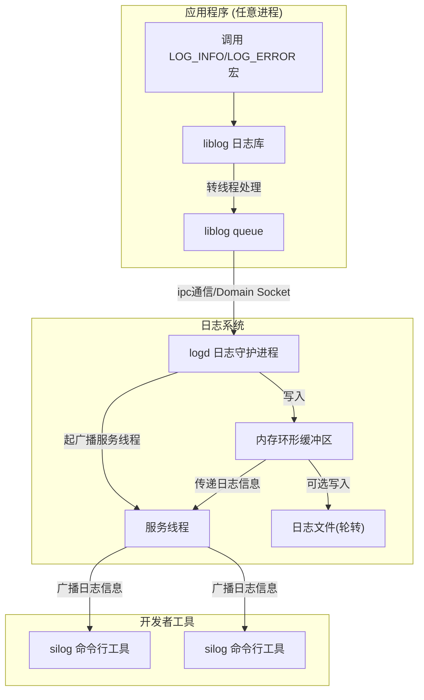
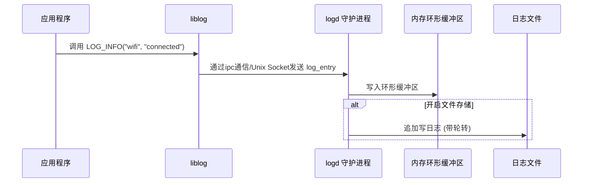
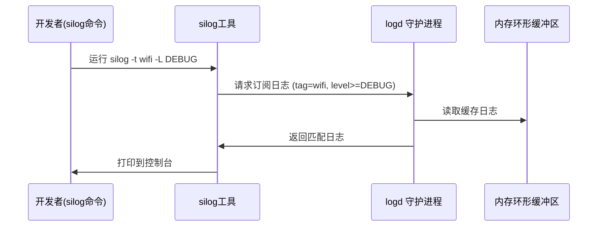
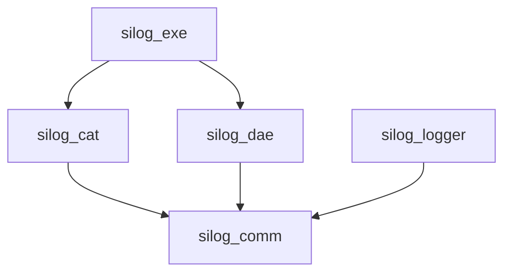

---
# 整体设计

## 1. 架构图



**特点**：

* 所有应用都通过 `liblog` 写日志
* `logd` 是唯一写文件和缓存日志的进程
* `silog` 是开发/调试用的查询工具

---

## 2. 日志写入时序图



---

## 3. 日志读取时序图



---

## 4. 模块划分

* **silog_comm** - 公共库
  * **prelog**: 预日志模块，系统初始化前记录日志
  * **mpsc**: 多生产者单消费者无锁队列
  * **trans**: 传输层抽象（UDP/TCP/Unix Socket）
  * **time**: 时间工具
  * **securec**: 安全字符串操作
* **libsilog**
  * API 宏：`LOG_INFO`, `LOG_ERROR`, …
  * 封装 `log_write()`，通过 socket 发消息
* **silogd**
  * 接收日志：socket
  * 缓冲：环形队列
  * 输出：文件轮转 / 提供查询
* **silog**
  * CLI 工具
  * 过滤：tag、level、pid
  * 输出：stdout、文件

# 具体实现

## libsilog对外接口

- 提供对外接口，用宏的方式封装调用，可以实现打印文件行和函数名

  ```c
  #define SILOG_TAG_MAX_LEN 32
  #define SILOG_FILE_MAX_LEN 64
  #define SILOG_MSG_MAX_LEN 256

    typedef enum {
      SILOG_DEBUG = 0,
      SILOG_INFO,
      SILOG_WARN,
      SILOG_ERROR,
      SILOG_FATAL
    } silogLevel;

    // 打印日志（printf 风格）
    void silogLog(silogLevel level, const char *tag, const char *fmt, ...);

    #define SILOG_D(tag, fmt, ...) silogLog(SILOG_DEBUG, tag, fmt, ##__VA_ARGS__)
    #define SILOG_I(tag, fmt, ...) silogLog(SILOG_INFO,  tag, fmt, ##__VA_ARGS__)
    #define SILOG_W(tag, fmt, ...) silogLog(SILOG_WARN,  tag, fmt, ##__VA_ARGS__)
    #define SILOG_E(tag, fmt, ...) silogLog(SILOG_ERROR, tag, fmt, ##__VA_ARGS__)
    #define SILOG_F(tag, fmt, ...) silogLog(SILOG_FATAL, tag, fmt, ##__VA_ARGS__)
  ```

- 定义ipc交互的log_entry

  ```c
    typedef struct {
      uint64_t ts;                          // 时间戳 (毫秒)
      pid_t pid;                             // 进程ID
      pid_t tid;                             // 线程ID
      silogLevel level;                   // 日志级别
      char tag[SILOG_TAG_MAX_LEN];           // 模块名
      char file[SILOG_FILE_MAX_LEN];         // 源文件名
      uint32_t line;                         // 行号
      char msg[SILOG_MSG_MAX_LEN];           // 日志正文
      uint16_t msgLen;                      // 日志正文长度
      uint8_t enabled;                       // 预测分支快速判断标志
    } logEntry_t;
  ```

## silogd守护进程

### 模块 A：Unix Socket Server（接收日志）

- bind `/tmp/silogd.sock`
- 循环接收 log_entry
- 放入内存环形缓冲区（可选）
- 按需广播给连接的客户端

### 模块 B：日志写文件（带轮转）

日志文件管理模块（`silog_file_manager`）负责日志的持久化存储和轮转管理。

#### 文件命名规则

```
silog.log                    # 当前日志文件
silog_20250127_153045.log    # 轮转后的历史文件（带时间戳：年月日_时分秒）
silog_20250127_140230.log.gz # 压缩后的历史文件（可选）
```

#### 轮转策略

当日志文件大小超过配置的 `maxFileSize`（默认 10MB）时触发轮转：

1. 关闭当前日志文件
2. 重命名为 `silog_YYYYMMDD_HHMMSS.log`
3. 重新打开新的 `silog.log` 文件
4. 删除最旧的历史文件（超过 `maxFileCount` 限制）
5. 可选：异步压缩历史文件

#### 刷盘模式

- **同步刷盘（SYNC）**：每次写入后立即调用 `fflush()`
- **异步刷盘（ASYNC，默认）**：
  - 累积写入字节数达到 `asyncFlushSize`（默认 4KB）时刷盘
  - 距离上次刷盘超过 `asyncFlushIntervalMs`（默认 1000ms）时刷盘

#### 配置接口

```c
// 使用自定义配置初始化,传空使用默认配置初始化
int32_t SilogFileManagerInitWithConfig(const SilogLogFileConfig *config);

// 运行时配置接口
void SilogFileManagerSetMaxFileSize(uint32_t size);
void SilogFileManagerSetMaxFileCount(uint32_t count);
void SilogFileManagerSetCompression(bool enable);
void SilogFileManagerSetFlushMode(SilogFlushMode mode);
// ...
```

#### 轮转失败处理

- 轮转失败时进行重试（默认 3 次，每次间隔 100ms）
- 重试失败后继续打开新文件写入日志，不阻塞日志系统
- 记录错误到预日志文件

#### 压缩支持

- 可配置是否启用压缩（默认关闭）
- 使用 gzip 压缩历史日志文件
- 压缩操作在轮转后异步执行

### 模块 C：客户端实时日志输出（logcat 功能）

- logd 再开 **一个 UDS 监听端口** `/tmp/silogd_client.sock`
- 客户端执行 `silogcat` → 连接
- logd 将每条日志 **广播** 给所有连接的客户端

### 模块 D：后台 Daemon 化


## silog客户端

silog客户端（`silogcat`）用于通过网络连接到守护进程，实时查看日志输出。

### 命令行参数

| 参数 | 说明 | 默认值 |
|------|------|--------|
| `-s, --server <addr>` | 服务器地址 | `127.0.0.1` |
| `-p, --port <port>` | 服务器端口 | `9090` |
| `-t, --tag <tag>` | 过滤标签 | - |
| `-l, --level <level>` | 最小日志级别 | `DEBUG` |
| `-c, --color` | 彩色输出 | - |
| `-h, --help` | 显示帮助 | - |

### 使用示例

```bash
# 连接到本地守护进程
./silogcat

# 连接远程服务器
./silogcat -s 192.168.1.100 -p 9090

# 过滤标签
./silogcat -t Network

# 只显示 WARN 及以上级别
./silogcat -l WARN

# 彩色输出
./silogcat -c
```

---

## 编译构建

### 环境要求

- Linux 操作系统（支持 Unix Domain Socket）
- GCC 编译器（支持 C11）
- CMake 3.10+
- pthread 库

### 编译步骤

```bash
# 进入项目根目录
cd SiLog

# 创建构建目录
mkdir -p build && cd build

# 配置 CMake
cmake ..

# 编译
make -j4

# 运行测试
make test
```

### 编译输出

```
build/
├── silog_exe/silog              # 守护进程管理工具
├── silog_cat/silogcat           # 远程日志查看工具
├── silog_logger/libsilog_logger.so
├── silog_dae/libsilog_dae.so
└── tests/                        # 测试程序
```

---

## 快速开始

### 1. 启动守护进程

```bash
# 后台启动守护进程
./build/silog_exe/silog start -d

# 查看状态
./build/silog_exe/silog status
```

### 2. 发送测试日志

```bash
# 使用 silog 发送测试日志
./build/silog_exe/silog test

# 或运行测试程序
./build/tests/legacy/silog_test
```

### 3. 查看日志文件

```bash
# 查看本地日志文件
tail -f /tmp/silog/silog.log
```

### 4. 远程查看日志（可选）

```bash
# 在另一个终端启动 silogcat
./build/silog_cat/silogcat
```

### 5. 停止守护进程

```bash
./build/silog_exe/silog stop
```

---

## API 使用

### C/C++ API

#### 头文件

```c
#include "silog.h"  // 包含所有日志宏
```

#### 日志宏

| 宏 | 级别 | 说明 |
|----|------|------|
| `SILOG_D(tag, fmt, ...)` | DEBUG | 调试信息 |
| `SILOG_I(tag, fmt, ...)` | INFO | 普通信息 |
| `SILOG_W(tag, fmt, ...)` | WARN | 警告信息 |
| `SILOG_E(tag, fmt, ...)` | ERROR | 错误信息 |
| `SILOG_F(tag, fmt, ...)` | FATAL | 致命错误 |

#### 使用示例

```c
#include "silog.h"

#define TAG "MyApplication"

int main(void)
{
    SILOG_I(TAG, "Application started");
    SILOG_D(TAG, "Debug value: %d", 42);
    SILOG_E(TAG, "Error occurred");

    return 0;
}
```

#### 编译链接

```bash
gcc -o myapp myapp.c -I/path/to/SiLog/interface \
    -L/path/to/SiLog/build/silog_logger \
    -lsilog_logger -lpthread
```

#### 设置日志级别

```c
#include "silog_logger.h"

// 只记录 WARN 及以上级别
silogSetLevel(SILOG_WARN);
```

---

## 配置说明

### 日志文件位置

| 文件 | 说明 |
|------|------|
| `/tmp/silog/silog.log` | 主日志文件 |
| `/tmp/silogd.pid` | 守护进程 PID 文件 |
| `/tmp/silog_exe.txt` | silog_exe 预日志 |
| `/tmp/silog_daemon.txt` | 守护进程预日志 |

### 日志文件格式

```
[2026-03-07 23:48:52.0000][INFO][pid:103131 tid:103131][MyApp][main.c:45] Application started
```

字段说明：
- 时间戳 - 年月日 时分秒.毫秒
- 日志级别 - DEBUG/INFO/WARN/ERROR/FATAL
- 进程ID/线程ID
- 标签 - 模块标签
- 文件名:行号
- 消息内容

---

## 故障排除

### 守护进程无法启动

```bash
# 检查是否有残留进程
ps aux | grep silog

# 检查端口占用
lsof -i :9090

# 查看预日志
cat /tmp/silog_exe.txt

# 前台启动查看详细错误
./silog start
```

### 无法发送日志

```bash
# 检查守护进程是否运行
./silog status

# 检查 IPC socket
ls -la /tmp/logd.sock

# 查看守护进程预日志
cat /tmp/silog_daemon.txt
```

### silogcat 无法连接

```bash
# 检查守护进程状态
./silog status

# 检查端口监听
netstat -tlnp | grep 9090
```

---

## silog_comm - 公共库

公共库提供以下基础模块，被其他所有模块依赖：

### prelog - 预日志模块

预日志模块用于在日志系统完全初始化前记录日志。

**功能特性：**
- 四级日志级别：DEBUG/INFO/WARNING/ERROR
- 模块标识区分不同组件（logger/daemon/cat/exe/comm）
- 线程安全（互斥锁保护）
- 可选的 stdout 输出

**API：**
```c
int32_t SilogPrelogInit(const SilogPrelogConfig_t *config);
void SilogPrelogDeinit(void);
int32_t SilogPrelogWrite(const char *module, SilogPrelogLevel_t level,
                         const char *fmt, ...);
```

**预定义模块宏：**
- `SILOG_PRELOG_LOGGER` - logger 模块
- `SILOG_PRELOG_DAEMON` - daemon 模块
- `SILOG_PRELOG_CAT` - cat 模块
- `SILOG_PRELOG_EXE` - exe 模块
- `SILOG_PRELOG_COMM` - comm 模块

**日志格式：**
```
[errno_str] [module] [LEVEL] message
```

示例：
```
[Success] [logger] [INFO] SiLog socket initialized
[No such file or directory] [daemon] [ERROR] Failed to open file
```

**详细文档：** [silog_comm/README_PRELOG.md](silog_comm/README_PRELOG.md)

### mpsc - 多生产者单消费者队列

无锁 MPSC 队列，用于高并发场景下的线程安全数据传递。

```c
SiLogMpscQueue queue;
SilogMpscQueueInit(&queue, elementSize, capacity);
SilogMpscQueuePush(&queue, &data);
SilogMpscQueuePop(&queue, &outData);
SilogMpscQueueDestroy(&queue);
```

### trans - 传输层

抽象传输层，支持 UDP/TCP/Unix Socket 通信。

```c
SilogTransInit(SILOG_TRAN_TYPE_UDP);
SilogTransClientSend(&data, len);
SilogTransServerRecv(&buf, len);
```

### time - 时间工具

```c
uint64_t ts = SilogGetNowMs();
SilogFormatWallClockMs(ts, buf, sizeof(buf));
```

### securec - 安全字符串操作

安全版本的字符串和内存操作函数，防止缓冲区溢出。

## 模块依赖关系



