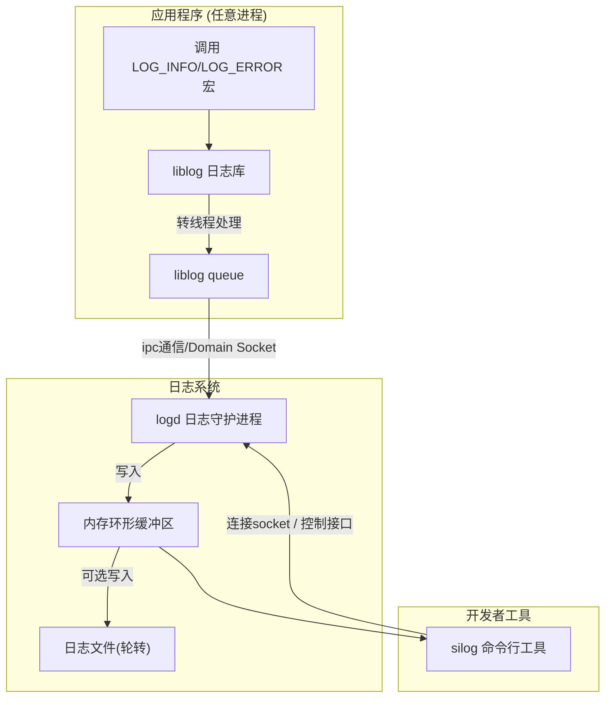
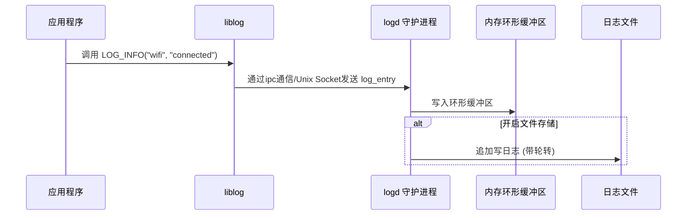
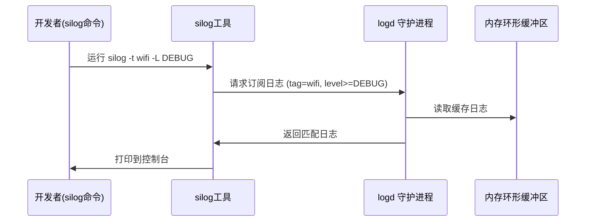

---
# 整体设计

## 1. 架构图



**特点**：

* 所有应用都通过 `liblog` 写日志
* `logd` 是唯一写文件和缓存日志的进程
* `silog` 是开发/调试用的查询工具

---

## 2. 日志写入时序图



---

## 3. 日志读取时序图



---

## 4. 模块划分

* **libsilog**
  * API 宏：`LOG_INFO`, `LOG_ERROR`, …
  * 封装 `log_write()`，通过 socket 发消息
* **silogd**
  * 接收日志：socket
  * 缓冲：环形队列
  * 输出：文件轮转 / 提供查询
* **silog**
  * CLI 工具
  * 过滤：tag、level、pid
  * 输出：stdout、文件

# 具体实现

## libsilog对外接口

- 提供对外接口，用宏的方式封装调用，可以实现打印文件行和函数名

  ```c
  #define SILOG_TAG_MAX_LEN 32
  #define SILOG_FILE_MAX_LEN 64
  #define SILOG_MSG_MAX_LEN 256

    typedef enum {
      SILOG_DEBUG = 0,
      SILOG_INFO,
      SILOG_WARN,
      SILOG_ERROR,
      SILOG_FATAL
    } silogLevel;

    // 打印日志（printf 风格）
    void silogLog(silogLevel level, const char *tag, const char *fmt, ...);

    #define SILOG_D(tag, fmt, ...) silogLog(SILOG_DEBUG, tag, fmt, ##__VA_ARGS__)
    #define SILOG_I(tag, fmt, ...) silogLog(SILOG_INFO,  tag, fmt, ##__VA_ARGS__)
    #define SILOG_W(tag, fmt, ...) silogLog(SILOG_WARN,  tag, fmt, ##__VA_ARGS__)
    #define SILOG_E(tag, fmt, ...) silogLog(SILOG_ERROR, tag, fmt, ##__VA_ARGS__)
    #define SILOG_F(tag, fmt, ...) silogLog(SILOG_FATAL, tag, fmt, ##__VA_ARGS__)
  ```

- 定义ipc交互的log_entry

  ```c
    typedef struct {
      uint64_t ts;                          // 时间戳 (毫秒)
      pid_t pid;                             // 进程ID
      pid_t tid;                             // 线程ID
      silogLevel level;                   // 日志级别
      char tag[SILOG_TAG_MAX_LEN];           // 模块名
      char file[SILOG_FILE_MAX_LEN];         // 源文件名
      uint32_t line;                         // 行号
      char msg[SILOG_MSG_MAX_LEN];           // 日志正文
      uint16_t msgLen;                      // 日志正文长度
      uint8_t enabled;                       // 预测分支快速判断标志
    } logEntry_t;
  ```

## silogd守护进程

### 模块 A：Unix Socket Server（接收日志）

- bind `/tmp/silogd.sock`
- 循环接收 log_entry
- 放入内存环形缓冲区（可选）
- 按需广播给连接的客户端

### 模块 B：日志写文件（带轮转）

- 写 log.txt
- 达到上限（比如 10MB）→ log.txt 重命名 log.1.txt → 新建 log.txt
- 使用 write()（文件 IO 不要用 fprintf）

### 模块 C：客户端实时日志输出（logcat 功能）

- logd 再开 **一个 UDS 监听端口** `/tmp/silogd_client.sock`
- 客户端执行 `silogcat` → 连接
- logd 将每条日志 **广播** 给所有连接的客户端

### 模块 D：后台 Daemon 化


## silog客户端


## 编译构建

